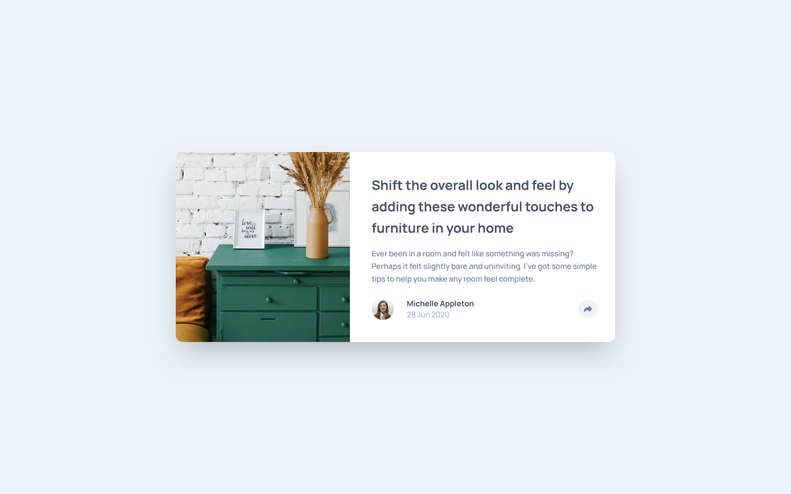
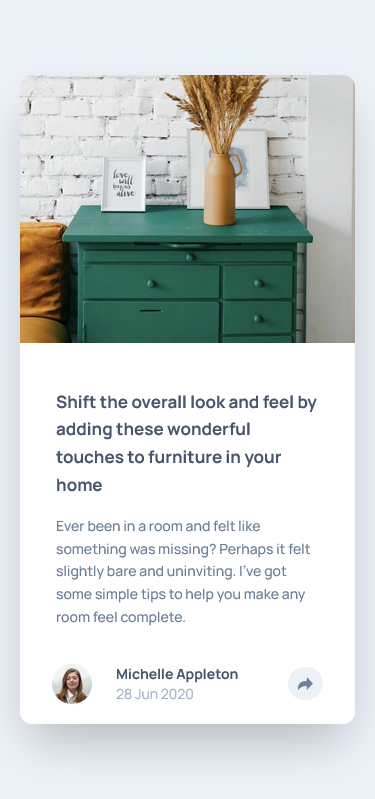

# Frontend Mentor - Article preview component solution

This is a solution to the [Article preview component challenge on Frontend Mentor](https://www.frontendmentor.io/challenges/article-preview-component-dYBN_pYFT). Frontend Mentor challenges help you improve your coding skills by building realistic projects. 

## Table of contents

- [Overview](#overview)
  - [The challenge](#the-challenge)
  - [Screenshot](#screenshot)
  - [Links](#links)
- [My process](#my-process)
  - [Built with](#built-with)
  - [What I learned](#what-i-learned)
  - [Continued development](#continued-development)
- [Author](#author)

## Overview

### The challenge

Users should be able to:

- View the optimal layout for the component depending on their device's screen size
- See the social media share links when they click the share icon

### Screenshot

### Links

- Solution URL: [https://github.com/Akiz-Ivanov/article-preview-component](https://github.com/Akiz-Ivanov/article-preview-component)
- Live Site URL: [https://akiz-ivanov.github.io/article-preview-component/](https://akiz-ivanov.github.io/article-preview-component/)

## My process

### Built with

#### ⚙️ Core Technologies
- [React](https://react.dev/) – UI rendering and state management
- [TypeScript](https://www.typescriptlang.org/) – Static type checking
- [Tailwind CSS](https://tailwindcss.com/) – Utility-first CSS for styling

#### 🔧 Tooling
- [Vite](https://vitejs.dev/) – Fast development server and build tool
- [npm](https://www.npmjs.com/) – Package manager

#### 🎯 Features & Techniques
- Custom popover component with manual positioning logic (no external libraries)
- Responsive layout with separate mobile & desktop popover variants
- Custom hooks for resize handling, layout updates, and outside click detection
- Accessibility enhancements using [react-focus-lock](https://github.com/theKashey/react-focus-lock)

#### 🎨 Design Source
- [Frontend Mentor](https://www.frontendmentor.io/) – Article Preview Component Challenge

### What I learned

Working on this project gave me a deeper understanding of:

- **Custom Popover Implementation**  
  I implemented a popover from scratch without relying on external libraries like Floating UI, giving me full control over positioning, flipping, arrow alignment, and responsive behavior.

- **Dynamic Positioning**  
  I handled edge cases such as insufficient viewport space by calculating layout manually using `getBoundingClientRect`, `ResizeObserver`, and conditional logic (e.g. flip strategies). This included dynamically positioning the arrow relative to the trigger button.

- **Focus Management**  
  I used `react-focus-lock` to trap focus inside the popover, ensuring accessibility for keyboard users and a consistent experience when tabbing.

- **Custom Hooks**  
  I created reusable hooks (`useWindowSize`, `usePopoverDismiss`, `usePopoverLayout`) to encapsulate state and logic around resizing, closing behavior (Escape key & outside click), and layout updates.

### Continued development

There are several improvements and refinements I'd like to explore in future iterations of this project:

- **Refactor positioning system using `transform`**  
  Currently using `top`/`left` for popover positioning; switching to `transform: translate` will allow for smoother, GPU-accelerated animations.

- **Add shift logic**  
  Implementing custom "shift" logic to nudge the popover into view when it's close to the viewport edge—this will work alongside the existing flip behavior for a more robust experience.

- **Manual focus management**  
  Remove the dependency on `react-focus-lock` and handle focus trapping and return manually for better understanding and control of accessibility concerns.

- **Reusable popover primitives**  
  Consider extracting and abstracting logic into more reusable hooks and components, such as a generalized popover or tooltip system that could be reused across projects.

This challenge served as a great learning opportunity in building popover logic manually

## Author

- Frontend Mentor - [@Akiz97](https://www.frontendmentor.io/profile/Akiz97)
- GitHub - [@Akiz-Ivanov](https://github.com/Akiz-Ivanov)