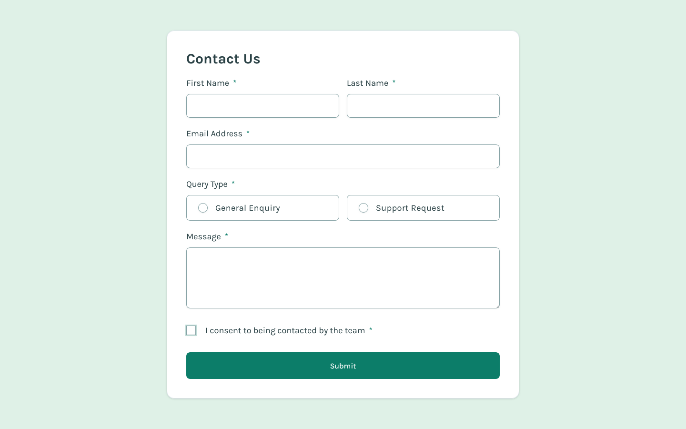
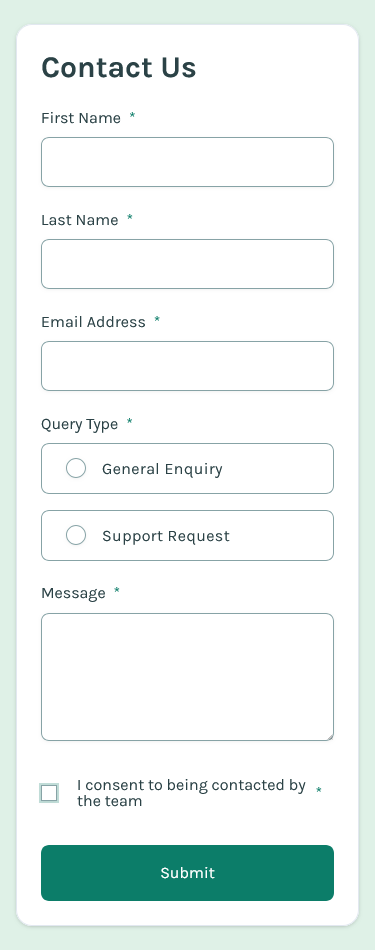

# Frontend Mentor - Contact form solution

This is a solution to the [Contact form challenge on Frontend Mentor](https://www.frontendmentor.io/challenges/contact-form--G-hYlqKJj). Frontend Mentor challenges help you improve your coding skills by building realistic projects. 

## Table of contents

- [Overview](#overview)
  - [The challenge](#the-challenge)
  - [Screenshot](#screenshot)
  - [Links](#links)
- [My process](#my-process)
  - [Built with](#built-with)
  - [Continued development](#continued-development)
- [Author](#author)

## Overview

### The challenge

Users should be able to:

- Complete the form and see a success toast message upon successful submission
- Receive form validation messages if:
  - A required field has been missed
  - The email address is not formatted correctly
- Complete the form only using their keyboard
- Have inputs, error messages, and the success message announced on their screen reader
- View the optimal layout for the interface depending on their device's screen size
- See hover and focus states for all interactive elements on the page

### Screenshot

#### Desktop

#### Mobile

### Links

- Solution URL: [https://github.com/Akiz-Ivanov/contact-form-fem](https://github.com/Akiz-Ivanov/contact-form-fem)
- Live Site URL: [https://akiz-ivanov.github.io/contact-form-fem/](https://akiz-ivanov.github.io/contact-form-fem/)

## My process

### Built with

#### Core Technologies
- [React](https://react.dev/) - Frontend library
- [TypeScript](https://www.typescriptlang.org/) - Static type checking
- [Tailwind CSS](https://tailwindcss.com/) - Utility-first CSS framework
- [ShadCN/ui](https://ui.shadcn.com/) - Accessible UI components
- [react-hot-toast](https://react-hot-toast.com/) - Toast notifications

#### Form Handling
- [React Hook Form](https://react-hook-form.com/) - Form state management
- [Zod](https://zod.dev/) - Schema-based validation

#### Tooling
- [Vite](https://vitejs.dev/) - Build tool and development server
- [npm](https://www.npmjs.com/) - Package manager

#### Design
- [Frontend Mentor](https://www.frontendmentor.io/) - Challenge platform

## Author

- Frontend Mentor - [@Akiz97](https://www.frontendmentor.io/profile/Akiz97)
- GitHub - [@Akiz-Ivanov](https://github.com/Akiz-Ivanov)