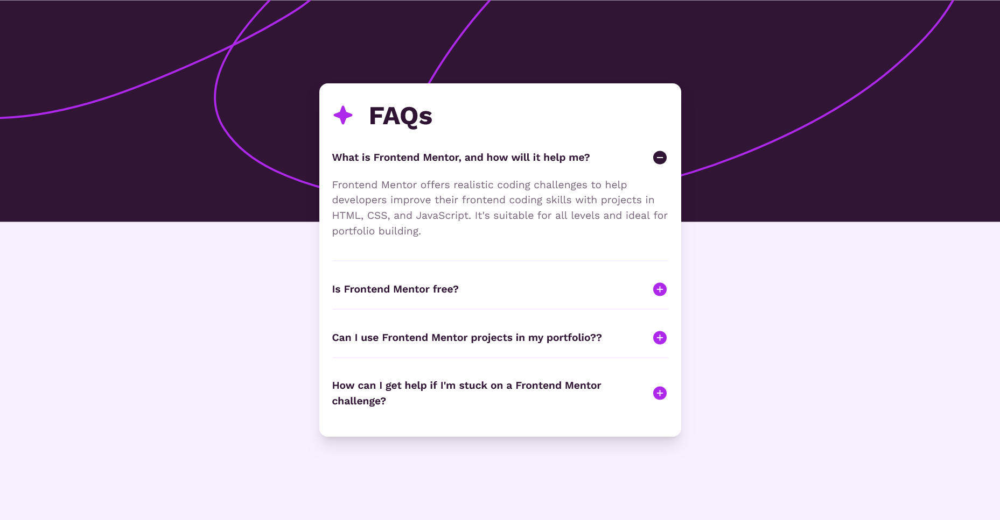
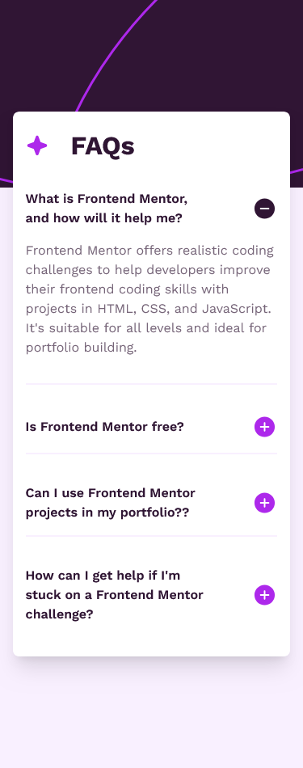

# Frontend Mentor - FAQ accordion solution

This is a solution to the [FAQ accordion challenge on Frontend Mentor](https://www.frontendmentor.io/challenges/faq-accordion-wyfFdeBwBz). Frontend Mentor challenges help you improve your coding skills by building realistic projects.

## Table of contents

- [Overview](#overview)
  - [The challenge](#the-challenge)
  - [Screenshot](#screenshot)
  - [Links](#links)
- [My process](#my-process)
  - [Built with](#built-with)
  - [What I learned](#what-i-learned)
- [Author](#author)

## Overview

### The challenge

Users should be able to:

- Hide/Show the answer to a question when the question is clicked
- Navigate the questions and hide/show answers using keyboard navigation alone
- View the optimal layout for the interface depending on their device's screen size
- See hover and focus states for all interactive elements on the page

### Screenshot

#### Desktop Design

#### Mobile Design

### Links

- Solution URL: [https://github.com/Akiz-Ivanov/FAQ-Accordion](https://github.com/Akiz-Ivanov/FAQ-Accordion)
- Live Site URL: [https://akiz-ivanov.github.io/FAQ-Accordion/](https://akiz-ivanov.github.io/FAQ-Accordion/)

## My process

### Built with

- React
- Tailwind CSS
- Headless UI (Disclosure component)
- Flexbox
- Mobile-first workflow

### What I learned

Through this project, I practiced using Tailwind CSS and Flexbox to create a responsive, clean layout. I also deepened my understanding of how to manage interactive elements in React, particularly with Headless UI, which provided a useful and accessible way to implement the accordion functionality.

## Author

- Frontend Mentor - [@Akiz97](https://www.frontendmentor.io/profile/Akiz97)