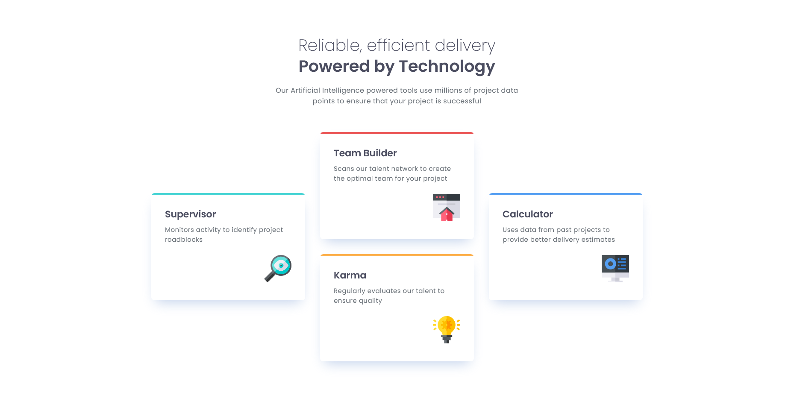

# Frontend Mentor - Four card feature section solution

This is a solution to the [Four card feature section challenge on Frontend Mentor](https://www.frontendmentor.io/challenges/four-card-feature-section-weK1eFYK). Frontend Mentor challenges help you improve your coding skills by building realistic projects. 

## Table of contents

- [Overview](#overview)
  - [The challenge](#the-challenge)
  - [Screenshot](#screenshot)
  - [Links](#links)
- [My process](#my-process)
  - [Built with](#built-with)
  - [What I learned](#what-i-learned)
- [Author](#author)


## Overview

### The challenge

Users should be able to:

- View the optimal layout for the site depending on their device's screen size

### Screenshot

#### Desktop Design



#### Mobile Design


### Links

- **Solution URL**: [https://github.com/Akiz-Ivanov/Four-Card-Feature-Section](https://github.com/Akiz-Ivanov/Four-Card-Feature-Section)
- **Live Site URL**: [https://akiz-ivanov.github.io/Four-Card-Feature-Section/](https://akiz-ivanov.github.io/Four-Card-Feature-Section/)

## My process

### Built with

- Semantic HTML5 markup
- CSS custom properties
- Flexbox
- CSS Grid
- Mobile-first workflow
- Sass


### What I learned

I dedicated more time to mastering Flexbox and Grid layouts, particularly learning how to use grid-template-areas to fine-tune designs. I also discovered a neat trick to avoid border-radius issues when the border is smaller than the radius using gradients:

```css
  .card {
    background: linear-gradient(to bottom, var(--Cyan) 5px, transparent 5px), var(--White);
  }
```


## Author

- Frontend Mentor - [@Akiz97](https://www.frontendmentor.io/profile/Akiz97)
