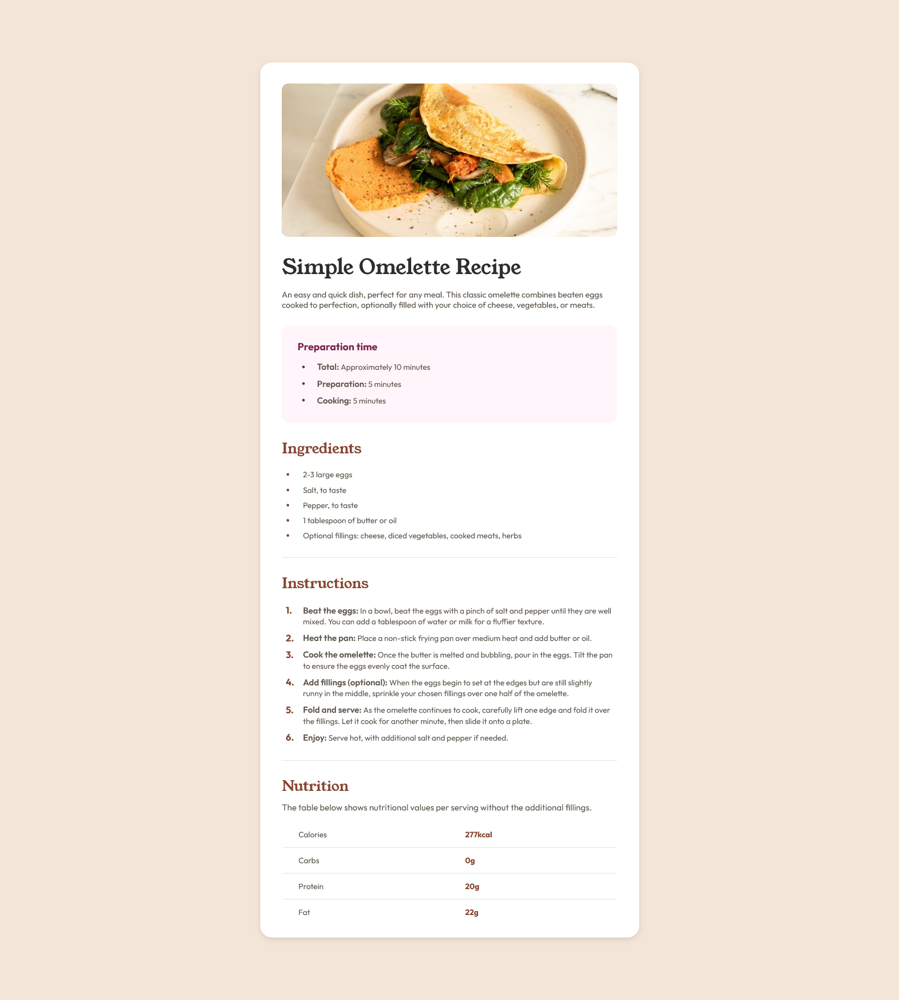
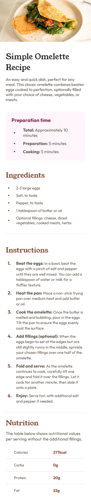

# Frontend Mentor - Recipe page solution

This is a solution to the [Recipe page challenge on Frontend Mentor](https://www.frontendmentor.io/challenges/recipe-page-KiTsR8QQKm). Frontend Mentor challenges help you improve your coding skills by building realistic projects. 

## Table of contents

- [Overview](#overview)
  - [Screenshot](#screenshot)
  - [Links](#links)
- [My process](#my-process)
  - [Built with](#built-with)
  - [What I learned](#what-i-learned)
- [Author](#author)

## Overview

### Screenshot

#### Desktop Design

#### Mobile Design

### Links

- **Solution URL**: [https://github.com/Akiz-Ivanov/Recipe-Page](https://github.com/Akiz-Ivanov/Recipe-Page)
- **Live Site URL**: [https://akiz-ivanov.github.io/Recipe-Page/](https://akiz-ivanov.github.io/Recipe-Page/)

## My process

### Built with

- Semantic HTML5 markup
- CSS custom properties
- Flexbox
- Mobile-first workflow
- [React](https://reactjs.org/) - JS library
- [Vite](https://vitejs.dev/) - Build tool

### What I learned

- Gained more hands-on experience with **React** by building components.
- Improved my **GitHub** skills, including committing changes, working with branches and **GitHub Pages**.

## Author

- Frontend Mentor - [@Akiz97](https://www.frontendmentor.io/profile/Akiz97)