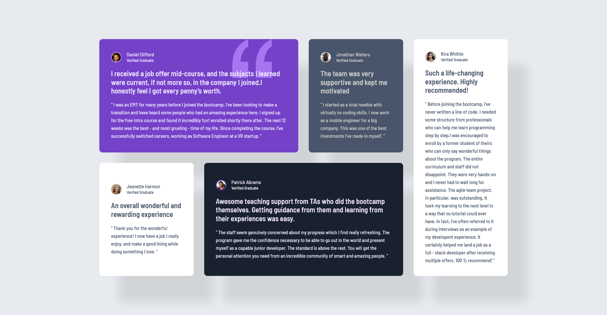

# Frontend Mentor - Testimonials grid section solution

This is a solution to the [Testimonials grid section challenge on Frontend Mentor](https://www.frontendmentor.io/challenges/testimonials-grid-section-Nnw6J7Un7). Frontend Mentor challenges help you improve your coding skills by building realistic projects. 

## Table of contents

- [Overview](#overview)
  - [The challenge](#the-challenge)
  - [Screenshot](#screenshot)
  - [Links](#links)
- [My process](#my-process)
  - [Built with](#built-with)
  - [What I learned](#what-i-learned)
  - [Continued development](#continued-development)
  - [Useful resources](#useful-resources)
- [Author](#author)
- [Acknowledgments](#acknowledgments)

## Overview

### The challenge

Users should be able to:

- View the optimal layout for the site depending on their device's screen size

### Screenshot

#### Desktop Design

#### Mobile Design

### Links

- Solution URL: [Add solution URL here](https://github.com/Akiz-Ivanov/Testimonials-Grid-Section)
- Live Site URL: [Add live site URL here](https://akiz-ivanov.github.io/Testimonials-Grid-Section/)

## My process

### Built with

- Semantic HTML5 markup
- CSS custom properties
- Flexbox
- CSS Grid
- SASS
- [React](https://reactjs.org/) - JS library

### What I learned

I got a lot of good practice with grids. One thing i will try to remember for the future is that inline grid styles are hard to overwrite for media queries.

## Author

- Frontend Mentor - [@Akiz97](https://www.frontendmentor.io/profile/Akiz97)